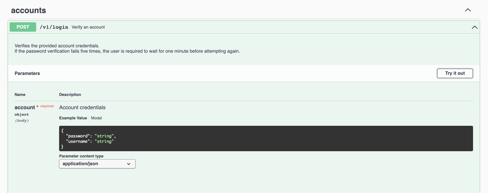
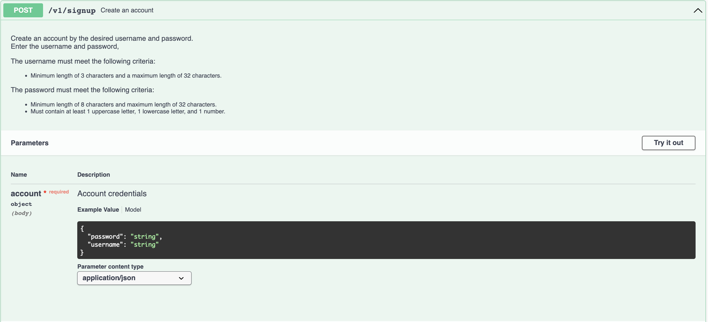
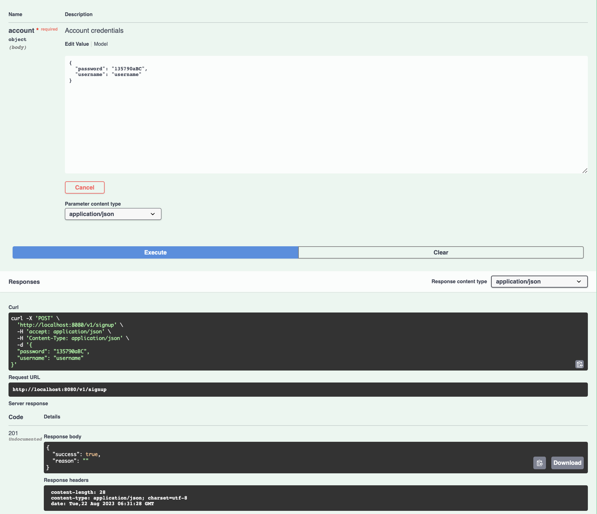
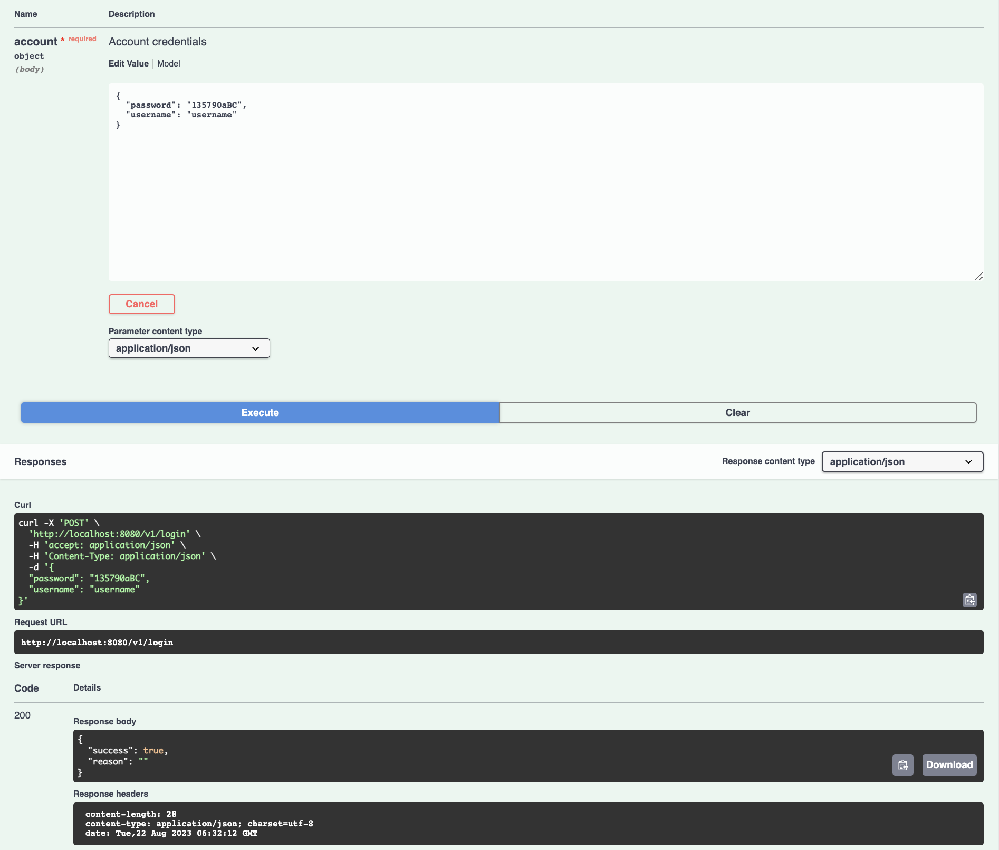
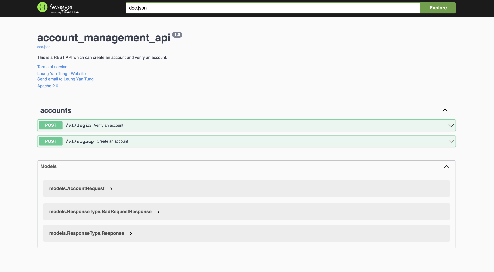

# Account Management API
These are two RESTful HTTP APIs for creating and verifying user accounts and passwords. The APIs are packaged in a Docker container and hosted on Docker Hub. 
This README provides an overview of the project, instructions for running the container with Docker, and details on using the APIs.

## Directory Structure
```bash
├── Dockerfile
├── README.md
├── api
│   ├── api.go
│   ├── api_test.go
│   ├── main_test.go
│   ├── routes.go
│   └── server.go
├── db
│   └── db.go
├── docker-compose.yml
├── docs
│   ├── docs.go
│   ├── swagger.json
│   └── swagger.yaml
├── errors
│   └── errors.go
├── go.mod
├── go.sum
├── main.go
├── models
│   ├── account.go
│   ├── account_test.go
│   └── models.go
├── services
│   └── account.go
└── utils
    ├── hash.go
    ├── random.go
    └── validation.go
```

## APIs Overview
### API 1: Sign up - Create Account

This API allows you to create a new user account with a desired username and password.

- *Endpoint*: `/v1/signup `
- *HTTP Method*: `POST`

#### Inputs:

```json
{
  "username": "string", // length: 3~32
  "password": "string" // length: 8~32, with 1 lowercase letter, 1 uppercase letter and 1 number
}
```

#### Outputs:
```json
{
  "success": true, // boolean, true or false
  "reason": "string" // reason for failure if applicable
}
```

### API 2: Log in - Verify Account and Password
This API allows you to verify if a given username and password combination is valid.

- *Endpoint*: `/v1/login`
- *HTTP Method*: `POST`

#### Inputs:
```json
{
  "username": "string", // length: 3~32
  "password": "string" // length: 8~32, with 1 lowercase letter, 1 uppercase letter and 1 number
}
```
#### Outputs:
```json
{
  "success": true, // boolean, true or false
  "reason": "string" // reason for failure if applicable
}
```

## Getting Started
To use the Account Management APIs, there are three options for you to deploy them. Follow these steps:

**Install *Docker* before deployment.**

### Option1. Just run the `./start.sh`
Both of two options are provided in `./start.sh`
```bash
./start.sh
> Choose deployment method:
> 1. Pull Docker image from Docker Hub and run
> 2. Clone repo and run using Docker Compose
> Enter your choice (1/2):
```

### Option2. Pull the Docker Image from Docker Hub and Deploy:
[Docker Hub Repository](https://hub.docker.com/r/ushio0107/account_management_api)
```bash
docker network create <YOUR_NETWORK>
# Pull Docker image
docker pull ushio0107/account_management_api
docker pull mongo:4.4
# Run Docker
docker run --name mongo \
  --network <YOUR_NETWORK>
	-e MONGO_INITDB_ROOT_USERNAME=<DB_USERNAME> \
	-e MONGO_INITDB_ROOT_PASSWORD=<DB_PASSWORD> \
	-v ./data:/data/db \
	-p 27017:27017 \
	-d mongo:4.4 
docker run --network <YOUR_NETWORK> -e <YourEnvironmentVariable> ushio0107/account_management_api
```

### Option3. Clone the Repo
```bash
git clone git@github.com:ushio0107/api_account_management.git
cd api_account_management
vi .env # Set your environment variable if need.
docker-compose up
```

You can also modify the `docker-compose.yml` to make the container `api` deployed by `Dockerfile` not the image from `Docker hub`.
```yml
api:
    container_name: account_api
    build:
    # build from Dockerfile
      context: .
      dockerfile: Dockerfile
    # image: ushio0107/account_management_api
```

### Access the APIs:
The APIs are documented by Swagger, starts the container of the APIs and accesses the link below to access the APIs.
> http://localhost:8080/swagger/index.html

Click the button `Try it out`, then input the parameter.



#### Demo
- Sign up

- Log in


### API Documentation
For detailed information on how to use the APIs, including sample request and response, please refer to the [link](http://localhost:8080/swagger/index.html).



## Source Code
The source code for the solution is available on GitHub at `github.com/ushio0107/api_account_management`.

